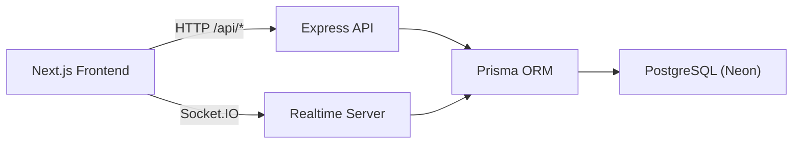
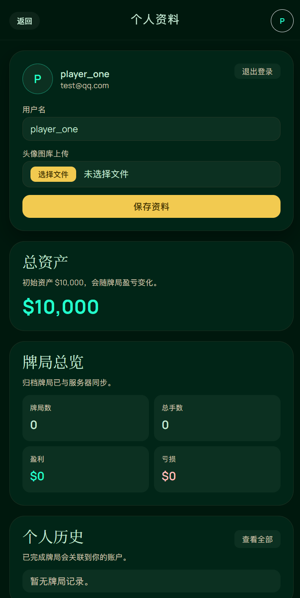
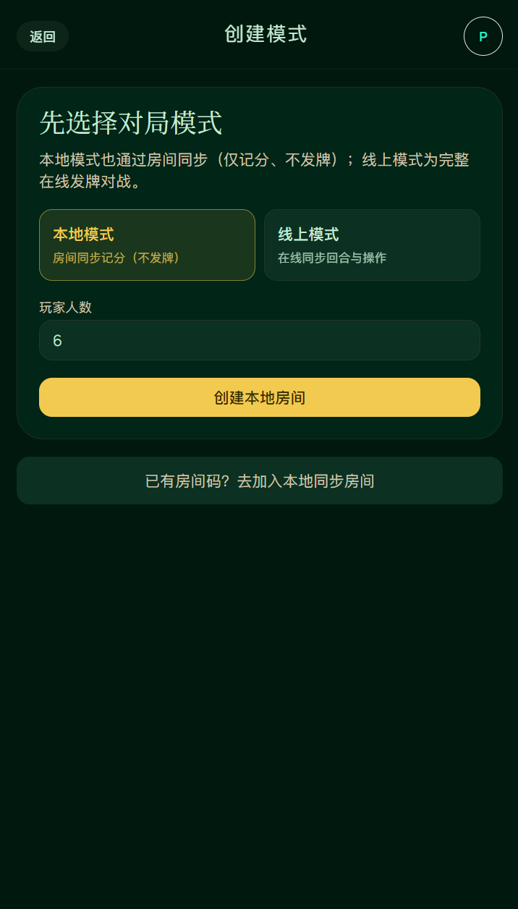
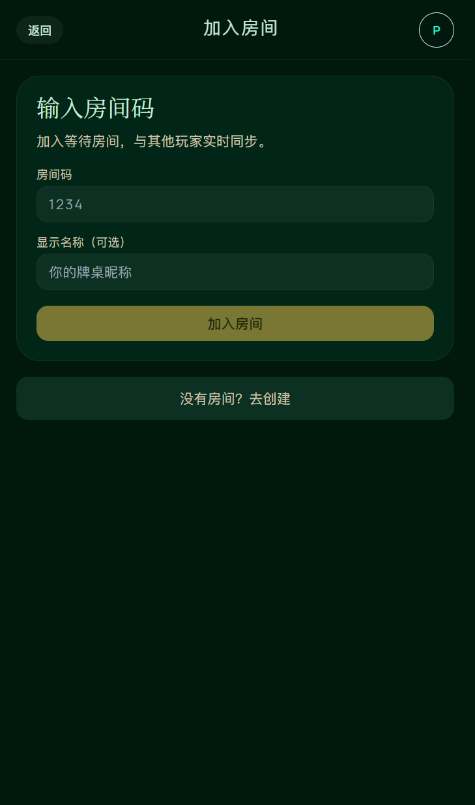
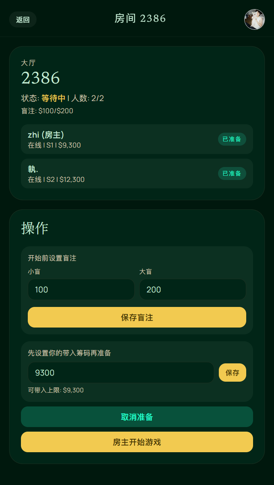
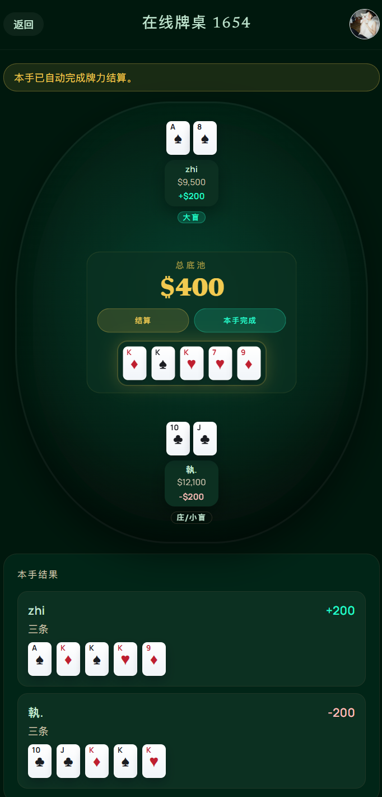

<!-- Improved compatibility of back to top link: See: https://github.com/othneildrew/Best-README-Template/pull/73 -->
<a id="readme-top"></a>

[![Contributors][contributors-shield]][contributors-url]
[![Forks][forks-shield]][forks-url]
[![Stargazers][stars-shield]][stars-url]
[![Issues][issues-shield]][issues-url]
[![Tech][tech-shield]][tech-url]
[![Status][status-shield]][status-url]

<br />
<div align="center">
  <a href="https://github.com/YanYihann/poker-chip-tracker">
    <h1 align="center">PokerChip Ledger</h1>
  </a>

  <p align="center">
    面向德州扑克 Home Game 的计分与结算系统，支持本地模式与联机房间模式（服务端权威状态）。
    <br />
    <a href="https://github.com/YanYihann/poker-chip-tracker/tree/main/docs"><strong>Explore the docs »</strong></a>
    <br />
    <br />
    <a href="https://github.com/YanYihann/poker-chip-tracker/issues/new?labels=bug">Report Bug</a>
    &middot;
    <a href="https://github.com/YanYihann/poker-chip-tracker/issues/new?labels=enhancement">Request Feature</a>
  </p>
</div>

<details>
  <summary>Table of Contents</summary>
  <ol>
    <li>
      <a href="#about-the-project">About The Project</a>
      <ul>
        <li><a href="#built-with">Built With</a></li>
      </ul>
    </li>
    <li>
      <a href="#getting-started">Getting Started</a>
      <ul>
        <li><a href="#prerequisites">Prerequisites</a></li>
        <li><a href="#installation">Installation</a></li>
        <li><a href="#environment-variables">Environment Variables</a></li>
      </ul>
    </li>
    <li><a href="#usage">Usage</a></li>
    <li><a href="#screenshots">Screenshots</a></li>
    <li><a href="#project-structure">Project Structure</a></li>
    <li><a href="#roadmap">Roadmap</a></li>
    <li><a href="#contributing">Contributing</a></li>
    <li><a href="#license">License</a></li>
    <li><a href="#contact">Contact</a></li>
    <li><a href="#acknowledgments">Acknowledgments</a></li>
  </ol>
</details>

## About The Project

PokerChip Ledger 是一个德州扑克筹码记账与结算工具，覆盖从开局建桌、座位与买入管理、手牌行动、实时同步到会话归档与个人历史查询的完整流程。

### 核心特性

- 本地模式：快速开局，适合线下局现场手动记分。
- 联机模式：基于房间码加入，服务端权威状态，避免多端状态漂移。
- 行动与结算：支持 `Fold / Check / Call / Bet / Raise / All-in` 与摊牌结算。
- 结算归档：会话结束后沉淀个人历史与统计信息。
- 账号体系：注册、登录、会话 Cookie 鉴权、个人资料维护。
- 实时通道：Socket.IO 推送房间状态与动作补丁。

### Architecture



<p align="right">(<a href="#readme-top">back to top</a>)</p>

### Built With

- [![Next][Next.js]][Next-url]
- [![React][React.js]][React-url]
- [![TypeScript][TypeScript]][TypeScript-url]
- [![TailwindCSS][TailwindCSS]][TailwindCSS-url]
- [![Express][Express.js]][Express-url]
- [![Prisma][Prisma]][Prisma-url]
- [![Socket.IO][Socket.IO]][SocketIO-url]
- [![PostgreSQL][PostgreSQL]][PostgreSQL-url]

<p align="right">(<a href="#readme-top">back to top</a>)</p>

## Getting Started

### Prerequisites

- Node.js `>=20`（后端 `server/package.json` 已声明）
- npm `>=10`（推荐）
- PostgreSQL（本地）或 Neon Postgres（云端）

### Installation

1. Clone 仓库
   ```bash
   git clone git@github.com:YanYihann/poker-chip-tracker.git
   cd poker-chip-tracker
   ```
2. 安装前后端依赖
   ```bash
   npm install
   cd server && npm install && cd ..
   ```
3. 配置环境变量
   ```bash
   cp .env.example .env.local
   cp server/.env.example server/.env
   ```
4. 初始化 Prisma
   ```bash
   cd server
   npm run prisma:generate
   npm run prisma:migrate:dev
   ```
5. 启动后端与前端
   ```bash
   # terminal 1
   cd server
   npm run dev
   ```
   ```bash
   # terminal 2
   npm run dev
   ```

### Environment Variables

前端（根目录 `.env.local`）：

| Variable | Description | Default |
| --- | --- | --- |
| `NEXT_PUBLIC_API_BASE_URL` | 后端完整地址；为空时使用当前 host + `NEXT_PUBLIC_API_PORT` | `""` |
| `NEXT_PUBLIC_API_PORT` | 后端端口回退值 | `4001` |

后端（`server/.env`）：

| Variable | Description | Default |
| --- | --- | --- |
| `DATABASE_URL` | 运行时数据库连接（推荐池化连接） | local postgres |
| `DATABASE_URL_DIRECT` | Prisma migration 直连地址 | local postgres |
| `PORT` | API 监听端口 | `4001` |
| `NODE_ENV` | 运行环境 | `development` |
| `CLIENT_ORIGIN` | 允许跨域来源，逗号分隔 | `http://localhost:3000,http://127.0.0.1:3000` |
| `SESSION_COOKIE_NAME` | 会话 Cookie 名称 | `poker_chip_session` |
| `SESSION_TTL_DAYS` | 会话有效天数 | `30` |

详细本地开发说明见 [docs/local-dev.md](docs/local-dev.md)。

<p align="right">(<a href="#readme-top">back to top</a>)</p>

## Usage

### 常用入口

- 首页：`/`
- 本地模式：`/local`
- 联机模式：`/online`
- 创建房间：`/rooms/create`
- 加入房间：`/rooms/join`
- 个人资料：`/profile`
- 历史记录：`/history`

### 健康检查

后端健康接口：

```http
GET /health
```

预期返回：

```json
{ "status": "ok", "database": "up" }
```

### 部署文档

- Railway + Neon: [docs/deployment-railway-neon.md](docs/deployment-railway-neon.md)
- 上线核对清单: [docs/deployment-checklist.md](docs/deployment-checklist.md)

<p align="right">(<a href="#readme-top">back to top</a>)</p>

## Screenshots

### 牌局模拟动图

<p align="center">
  
</p>

### 页面截图

<table align="center" cellpadding="10">
  <tr>
    <td align="center" width="50%">
      
    </td>
    <td align="center" width="50%">
      
    </td>
  </tr>
  <tr>
    <td align="center" width="50%">
      
    </td>
    <td align="center" width="50%">
      
    </td>
  </tr>
  <tr>
    <td align="center" width="50%">
      
    </td>
    <td align="center" width="50%">
      
    </td>
  </tr>
</table>

<p align="right">(<a href="#readme-top">back to top</a>)</p>

## Project Structure

```text
poker-chip-tracker/
├─ src/                  # Next.js 前端应用
├─ server/               # Express + Prisma 后端
│  ├─ src/
│  └─ prisma/
├─ docs/                 # 产品、规则、部署文档
├─ scripts/
└─ README.md
```

<p align="right">(<a href="#readme-top">back to top</a>)</p>

## Roadmap

- [x] 账号注册/登录与会话鉴权
- [x] 联机房间创建与加入
- [x] 服务端权威行动流与实时同步
- [x] 会话归档与个人历史页
- [ ] 完整自动化测试覆盖（核心结算与状态机）
- [ ] CI/CD 与质量闸门（lint/typecheck/test）
- [ ] 演示环境与公开 Demo

See the [open issues](https://github.com/YanYihann/poker-chip-tracker/issues) for a full list of proposed features (and known issues).

<p align="right">(<a href="#readme-top">back to top</a>)</p>

## Contributing

Contributions are what make the open source community such an amazing place to learn, inspire, and create. Any contributions you make are greatly appreciated.

1. Fork the Project
2. Create your Feature Branch (`git checkout -b feature/AmazingFeature`)
3. Commit your Changes (`git commit -m 'Add some AmazingFeature'`)
4. Push to the Branch (`git push origin feature/AmazingFeature`)
5. Open a Pull Request

<p align="right">(<a href="#readme-top">back to top</a>)</p>

## License

Distributed under the MIT License. See `LICENSE` for details.

<p align="right">(<a href="#readme-top">back to top</a>)</p>

## Contact

Maintainer: [@YanYihann](https://github.com/YanYihann)

Project Link: [https://github.com/YanYihann/poker-chip-tracker](https://github.com/YanYihann/poker-chip-tracker)

<p align="right">(<a href="#readme-top">back to top</a>)</p>

## Acknowledgments

- [Best-README-Template](https://github.com/othneildrew/Best-README-Template)
- [Next.js](https://nextjs.org/)
- [Prisma](https://www.prisma.io/)
- [Railway](https://railway.app/)
- [Neon](https://neon.tech/)

<p align="right">(<a href="#readme-top">back to top</a>)</p>

<!-- MARKDOWN LINKS & IMAGES -->
[contributors-shield]: https://img.shields.io/github/contributors/YanYihann/poker-chip-tracker.svg?style=for-the-badge
[contributors-url]: https://github.com/YanYihann/poker-chip-tracker/graphs/contributors
[forks-shield]: https://img.shields.io/github/forks/YanYihann/poker-chip-tracker.svg?style=for-the-badge
[forks-url]: https://github.com/YanYihann/poker-chip-tracker/network/members
[stars-shield]: https://img.shields.io/github/stars/YanYihann/poker-chip-tracker.svg?style=for-the-badge
[stars-url]: https://github.com/YanYihann/poker-chip-tracker/stargazers
[issues-shield]: https://img.shields.io/github/issues/YanYihann/poker-chip-tracker.svg?style=for-the-badge
[issues-url]: https://github.com/YanYihann/poker-chip-tracker/issues
[tech-shield]: https://img.shields.io/badge/Stack-Next.js%20%7C%20Express%20%7C%20Prisma-0A0A0A?style=for-the-badge
[tech-url]: https://github.com/YanYihann/poker-chip-tracker
[status-shield]: https://img.shields.io/badge/Status-Active%20Development-2C7A4B?style=for-the-badge
[status-url]: https://github.com/YanYihann/poker-chip-tracker/issues
[Next.js]: https://img.shields.io/badge/Next.js-000000?style=for-the-badge&logo=nextdotjs&logoColor=white
[Next-url]: https://nextjs.org/
[React.js]: https://img.shields.io/badge/React-20232A?style=for-the-badge&logo=react&logoColor=61DAFB
[React-url]: https://react.dev/
[TypeScript]: https://img.shields.io/badge/TypeScript-3178C6?style=for-the-badge&logo=typescript&logoColor=white
[TypeScript-url]: https://www.typescriptlang.org/
[TailwindCSS]: https://img.shields.io/badge/Tailwind_CSS-38B2AC?style=for-the-badge&logo=tailwind-css&logoColor=white
[TailwindCSS-url]: https://tailwindcss.com/
[Express.js]: https://img.shields.io/badge/Express-000000?style=for-the-badge&logo=express&logoColor=white
[Express-url]: https://expressjs.com/
[Prisma]: https://img.shields.io/badge/Prisma-2D3748?style=for-the-badge&logo=prisma&logoColor=white
[Prisma-url]: https://www.prisma.io/
[Socket.IO]: https://img.shields.io/badge/Socket.IO-010101?style=for-the-badge&logo=socketdotio&logoColor=white
[SocketIO-url]: https://socket.io/
[PostgreSQL]: https://img.shields.io/badge/PostgreSQL-316192?style=for-the-badge&logo=postgresql&logoColor=white
[PostgreSQL-url]: https://www.postgresql.org/
