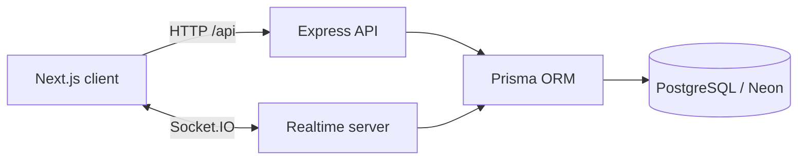
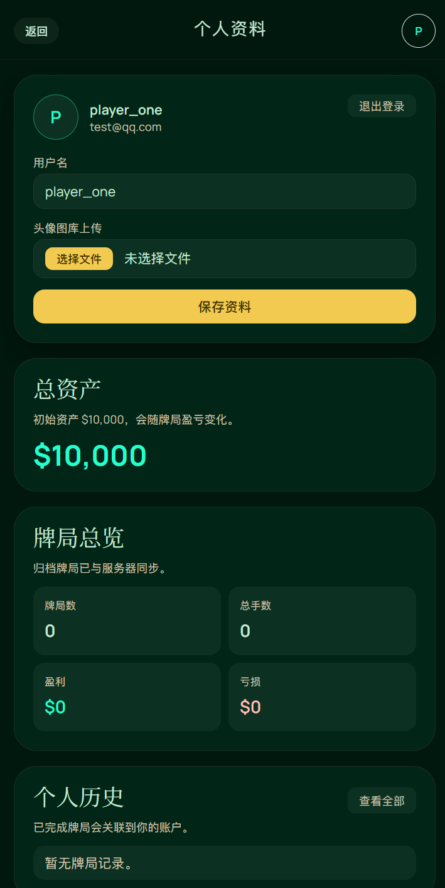
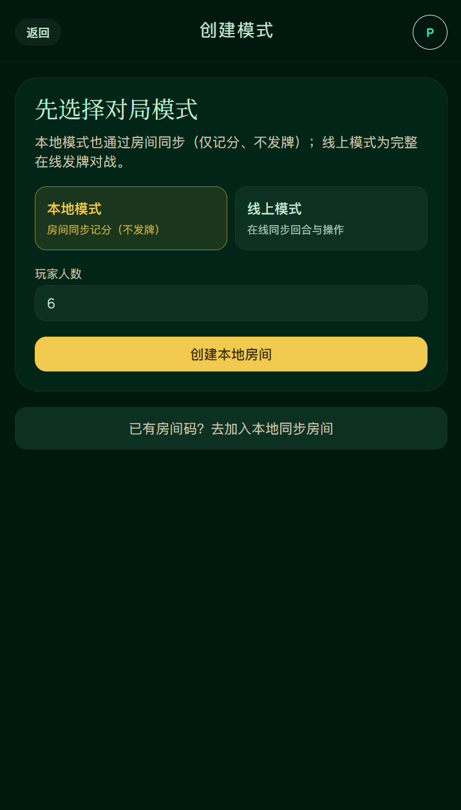
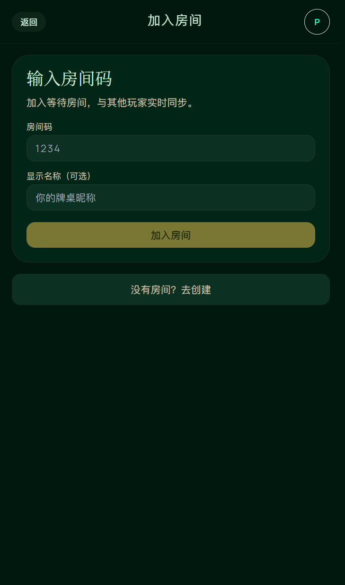

<a id="readme-top"></a>

<div align="center">

# PokerChip Ledger

**德州扑克 Home Game 的计分、牌局同步与结算工具。**

本地快速开局，或通过房间码进行服务端权威的多人联机牌局。

[Documentation](docs/) · [Report Bug](https://github.com/YanYihann/poker-chip-tracker/issues/new?labels=bug) · [Request Feature](https://github.com/YanYihann/poker-chip-tracker/issues/new?labels=enhancement)

[](https://nextjs.org/)
[](https://socket.io/)
[](https://www.postgresql.org/)
[](LICENSE)

</div>

## Overview

PokerChip Ledger covers a home-game session from table creation and buy-ins through player actions, showdown settlement, session archiving, and personal history. It supports two modes:

- **Local mode:** fast manual scorekeeping for an in-person table.
- **Online mode:** room-code access with server-authoritative state and Socket.IO synchronization.

> PokerChip Ledger is a scorekeeping utility. It does not process wagers, payments, or real-money gaming.

## Demo

<p align="center">
  
</p>

## Features

| Area | Capability |
| --- | --- |
| Table setup | Create a table, assign seats, and record buy-ins |
| Hand actions | Fold, check, call, bet, raise, and all-in |
| Settlement | Showdown settlement and balance calculation |
| Local play | Browser-based manual game tracking |
| Online rooms | Join by room code with authoritative server state |
| Realtime | Socket.IO room updates and action patches |
| Accounts | Registration, login, session-cookie authentication, and profiles |
| History | Archived sessions and personal statistics |

## Architecture


```mermaid
flowchart LR
  C["Next.js client"] -->|HTTP /api| E["Express API"]
  C <-->|Socket.IO| R["Realtime server"]
  E --> P["Prisma ORM"]
  R --> P
  P --> D[(PostgreSQL / Neon)]
```

The server owns online-room state. Clients render the current state and submit actions but should not be trusted to settle balances or mutate another player's data.

## Quick start

### Prerequisites

- Node.js 20 or newer
- npm 10 or newer
- PostgreSQL locally, or a Neon database

### Install

```bash
git clone https://github.com/YanYihann/poker-chip-tracker.git
cd poker-chip-tracker
npm install
cd server
npm install
cd ..
```

Create the frontend and backend environment files:

```bash
cp .env.example .env.local
cp server/.env.example server/.env
```

Windows PowerShell users can replace `cp` with `Copy-Item`.

Initialize Prisma:

```bash
cd server
npm run prisma:generate
npm run prisma:migrate:dev
```

Run the backend and frontend in separate terminals:

```bash
# terminal 1
cd server
npm run dev
```

```bash
# terminal 2, repository root
npm run dev
```

The frontend defaults to `http://localhost:3000`; the API defaults to port `4001`.

## Configuration

Frontend, `.env.local`:

| Variable | Purpose | Default |
| --- | --- | --- |
| `NEXT_PUBLIC_API_BASE_URL` | Complete backend URL | Current host plus API port |
| `NEXT_PUBLIC_API_PORT` | Backend-port fallback | `4001` |

Backend, `server/.env`:

| Variable | Purpose | Default |
| --- | --- | --- |
| `DATABASE_URL` | Runtime database connection | Local PostgreSQL |
| `DATABASE_URL_DIRECT` | Direct connection for Prisma migrations | Local PostgreSQL |
| `PORT` | API port | `4001` |
| `CLIENT_ORIGIN` | Allowed frontend origins | Local port 3000 origins |
| `SESSION_COOKIE_NAME` | Authentication cookie name | `poker_chip_session` |
| `SESSION_TTL_DAYS` | Session lifetime | `30` |

See [`docs/local-dev.md`](docs/local-dev.md) for the complete development guide.

## Main routes

| Route | Purpose |
| --- | --- |
| `/` | Product entry page |
| `/local` | Local scorekeeping mode |
| `/online` | Online mode entry |
| `/rooms/create` | Create a room |
| `/rooms/join` | Join by room code |
| `/profile` | Account profile |
| `/history` | Archived sessions and statistics |

Backend health check:

```http
GET /health
```

```json
{ "status": "ok", "database": "up" }
```

## Screenshots

| Profile | Create room |
| --- | --- |
|  |  |

| Join room | Online table |
| --- | --- |
|  |  |

## Repository map

```text
poker-chip-tracker/
├── src/               # Next.js frontend
├── server/            # Express, Socket.IO, Prisma, and API code
├── docs/              # Development, deployment, and media documentation
├── scripts/           # Project maintenance scripts
├── .env.example       # Frontend environment reference
└── LICENSE            # MIT License
```

## Development checks

```bash
npm run typecheck
npm run lint
npm run build

cd server
npm run typecheck
npm run lint
npm run build
```

Deployment references:

- [Railway + Neon guide](docs/deployment-railway-neon.md)
- [Deployment checklist](docs/deployment-checklist.md)

## Security and operational notes

- Use TLS, strong secrets, secure cookies, restricted CORS origins, and least-privilege database credentials in production.
- Back up the database and define retention/deletion rules for account and game-history data.
- Validate every action on the server and rate-limit authentication and room endpoints.
- Review applicable local rules before using scorekeeping software in organized games.

## Contributing

Fork the repository, create a focused feature branch, include tests or reproduction steps where appropriate, and open a pull request with the user-facing impact described clearly.

## License

Distributed under the [MIT License](LICENSE).

## Acknowledgments

README structure is inspired by [Best-README-Template](https://github.com/othneildrew/Best-README-Template) and the examples curated in [awesome-readme](https://github.com/matiassingers/awesome-readme).

<p align="right"><a href="#readme-top">Back to top</a></p>


